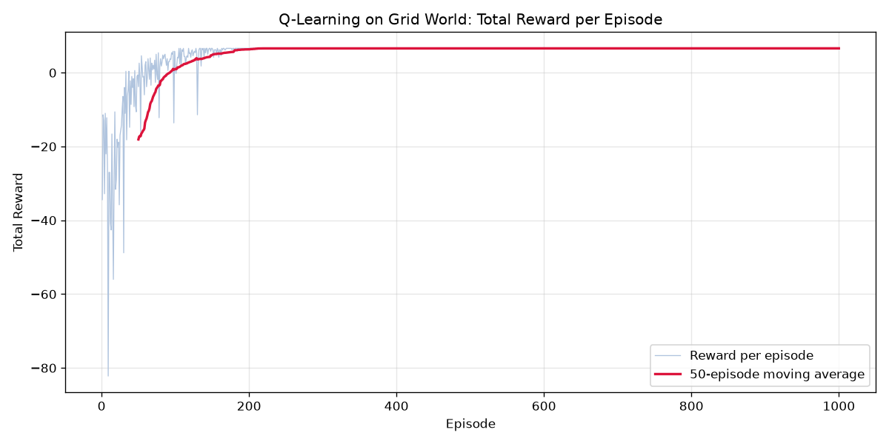
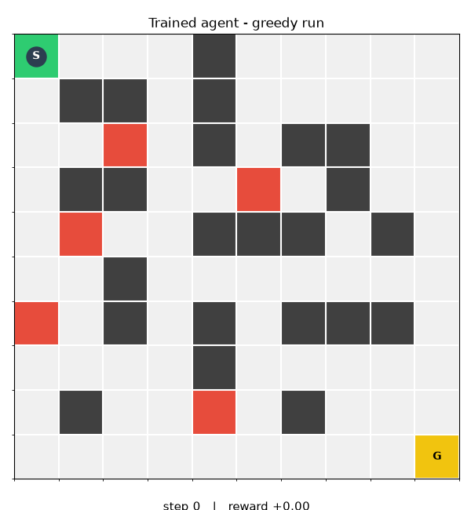

<div align="center">


# Exploration Strategies in Reinforcement Learning

### A comparative study in tabular Q-learning

*Built for the **Reinforcement Learning** course at TUHH — Hamburg University of Technology*

[](https://www.python.org/)
[](https://numpy.org/)
[](https://matplotlib.org/)
[](./LICENSE)

*A from-scratch, dependency-light implementation of four exploration mechanisms on top of
tabular Q-learning, all navigating the same 10×10 Grid World maze.*

</div>

---

## Table of Contents

- [Abstract](#abstract)
- [Background](#background)
- [The Environment](#the-environment)
- [Q-Learning Foundations](#q-learning-foundations)
- [Exploration Strategies](#exploration-strategies)
  - [1. Epsilon-Greedy (Baseline)](#1-epsilon-greedy-baseline)
  - [2. Optimistic / Count-Based (UCB)](#2-optimistic--count-based-ucb)
  - [3. Information Gain (Model-Error Curiosity)](#3-information-gain-model-error-curiosity)
  - [4. Sampling (Bootstrapped Ensemble)](#4-sampling-bootstrapped-ensemble)
- [Results](#results)
- [Repository Structure](#repository-structure)
- [Getting Started](#getting-started)
- [Reproducibility](#reproducibility)
- [Repository Notes (Honest Disclosure)](#repository-notes-honest-disclosure)
- [License](#license)

---

## Abstract

This repository studies the **exploration–exploitation dilemma** in reinforcement learning
through a controlled, reproducible experiment. A tabular Q-learning agent learns to solve a
deterministic 10×10 Grid World maze while avoiding walls and traps. Four different
exploration mechanisms are implemented and compared: **epsilon-greedy**, **count-based
optimism (UCB)**, **model-error-based information gain**, and **bootstrapped sampling**.
Each mechanism is isolated in its own self-contained script so that its behaviour — and only
its behaviour — differs between runs.

The project is deliberately built **from first principles** using only `numpy`, `random`,
`matplotlib`, and `time`. No RL frameworks (`gym`, `stable-baselines`, `RLlib`, …) are used,
so every line of the learning algorithm is visible, inspectable, and easy to follow.

---

## Background

This work was developed as part of the **Reinforcement Learning** course at
**TUHH (Hamburg University of Technology)**. The exploration strategies correspond to
standard methods introduced in the course lectures:

- epsilon-greedy action selection,
- optimism in the face of uncertainty / upper-confidence bounds,
- intrinsic motivation through prediction error,
- posterior/ensemble sampling.

The goal is not to achieve state-of-the-art performance, but to make the *mechanism* of each
exploration strategy explicit and directly comparable on an identical environment.

---

## The Environment

`GridWorld` is a deterministic 10×10 maze. The agent starts at the top-left `S`, aims for the
bottom-right `G`, and must navigate around fixed walls (`#`) while avoiding traps (`T`).

```
   0 1 2 3 4 5 6 7 8 9
0  S . . . # . . . . .
1  . # # . # . . . . .
2  . . T . # . # # . .
3  . # # . . T . # . .
4  . T . . # # # . # .
5  . . # . . . . . . .
6  T . # . # . # # # .
7  . . . . # . . . . .
8  . # . . T . # . . .
9  . . . . . . . . . G
```

**Dynamics.** Movement is deterministic: the four actions `UP / DOWN / LEFT / RIGHT` change
`(row, col)`. Attempting to move into a wall or off the grid leaves the agent in place.

| Event | Reward | Episode ends? |
|---|---:|:---:|
| Reach the goal `G` | `+10.0` | yes (success) |
| Step on a trap `T` | `-10.0` | yes (failure) |
| Bump a wall / border | `-1.0` | no |
| Ordinary step | `-0.2` | no |

> The small negative step cost creates pressure to find **short** paths rather than wandering,
> which makes the quality of exploration visible in the final policy.

---

## Q-Learning Foundations

All four strategies share the same base learner. The agent maintains a table
`Q[state][action]` and improves it after every transition with the temporal-difference update:

$$
Q(s, a) \;\leftarrow\; Q(s, a) + \alpha \Big[\, \underbrace{r + \gamma \max_{a'} Q(s', a')}_{\text{TD target}} - Q(s, a) \,\Big]
$$

| Symbol | Meaning | Value |
|---|---|---|
| $\alpha$ | Learning rate | `0.1` |
| $\gamma$ | Discount factor | `0.9` |
| $\epsilon$ | Exploration rate (baseline) | `1.0 → 0.01`, decay `0.995`/episode |
| — | Episodes | `1000` |
| — | Max steps / episode | `200` |

The only thing that changes between the four scripts is **how the next action is selected**
(and, for two strategies, **how the reward signal is augmented**).

---

## Exploration Strategies

| # | Strategy | Exploration signal | File | Seed |
|:-:|---|---|---|:-:|
| 1 | Epsilon-greedy | random action with probability $\epsilon$ | [`exploration_greedy_epsilon.py`](strategies/exploration_greedy_epsilon.py) | `14` |
| 2 | Optimistic / UCB | reward bonus $\propto 1/\sqrt{N(s)}$ | [`exploration_optimistic.py`](strategies/exploration_optimistic.py) | `14` |
| 3 | Information gain | reward bonus $\propto$ forward-model error | [`exploration_info_gain.py`](strategies/exploration_info_gain.py) | `14` |
| 4 | Sampling | sample one of 10 Q-tables per episode | [`exploration_sampling.py`](strategies/exploration_sampling.py) | `14` |

---

### 1. Epsilon-Greedy (Baseline)

**File:** [`strategies/exploration_greedy_epsilon.py`](strategies/exploration_greedy_epsilon.py)

The reference implementation. With probability $\epsilon$ the agent picks a uniformly random
action; otherwise it exploits its current estimate:

$$
a_t =
\begin{cases}
\text{random action} & \text{with probability } \epsilon \\[4pt]
\arg\max_{a} Q(s_t, a) & \text{with probability } 1 - \epsilon
\end{cases}
$$

Epsilon is annealed geometrically after each episode
(`epsilon ← max(0.01, epsilon × 0.995)`), so early episodes explore broadly while later
episodes exploit the learned policy. This is the simplest possible mechanism and the natural
benchmark for the others.

---

### 2. Optimistic / Count-Based (UCB)

**File:** [`strategies/exploration_optimistic.py`](strategies/exploration_optimistic.py)

Instead of injecting randomness into action selection, this variant makes **rarely visited
states look attractive** by augmenting the reward with an optimism bonus:

$$
r' = r + \frac{c}{\sqrt{N(s)}}, \qquad c = 1.0
$$

where $N(s)$ is the number of times state $s$ has been visited. The bonus shrinks as a state
is revisited, so the agent is systematically driven toward the least-explored regions — the
classic *optimism in the face of uncertainty* principle underlying UCB bandit algorithms.
The Q-learning update is then applied with the augmented reward $r'$.

---

### 3. Information Gain (Model-Error Curiosity)

**File:** [`strategies/exploration_info_gain.py`](strategies/exploration_info_gain.py)

This variant rewards the agent for **learning about the world**. The agent maintains an
internal forward model $\hat{f}(s,a)$ of the expected displacement `(Δrow, Δcol)`, updated as
a running average. The squared prediction error becomes an intrinsic reward:

$$
r' = r + \beta \, \big\| \hat{f}(s,a) - (s' - s) \big\|^2, \qquad \beta = 0.5
$$

Predictions that are still inaccurate produce a large bonus, so the agent is attracted to
transitions it does not yet understand. As the model converges, the bonus vanishes and the
agent falls back on the extrinsic task reward. This is the tabular analogue of
prediction-error curiosity / intrinsic motivation.

---

### 4. Sampling (Bootstrapped Ensemble)

**File:** [`strategies/exploration_sampling.py`](strategies/exploration_sampling.py)

Rather than exploring through an explicit bonus, this variant explores through **uncertainty
over value functions**. It keeps an ensemble of `grid_size` (= 10) independently initialised
Q-tables. At the start of each episode, one hypothesis $k$ is sampled uniformly and used to
act:

$$
k \sim \mathrm{Uniform}\{1, \dots, K\}, \qquad a_t = \arg\max_a Q_k(s_t, a)
$$

Every table is then updated from the observed transition (a simplified, tabular form of
bootstrapped ensembling / posterior sampling). Behavioural diversity across episodes comes
from the disagreement between ensemble members. After training, the ensemble is **averaged**
into a single greedy Q-table for evaluation and policy printing.

---

## Results

### Learning curve

The raw per-episode return is noisy (exploration is stochastic); the moving average exposes
the underlying learning trend.



### Watching the agent learn

Recorded episodes from across training, replayed back-to-back — early episodes wander,
later episodes head almost straight for the goal.


### Final greedy policy

The trained policy executed with exploration switched off (pure `argmax` over the Q-table).



> **Reading the results.** All four strategies converge to a successful policy, but they get
> there differently: epsilon-greedy explores uniformly, optimism is drawn to unvisited cells,
> curiosity is drawn to unpredictable transitions, and sampling explores in proportion to
> ensemble disagreement. The learning curve makes the sample-efficiency differences between
> these behaviours directly comparable.

---

## Repository Structure

```
exploration/
├── strategies/
│   ├── exploration_greedy_epsilon.py   # Baseline: epsilon-greedy exploration
│   ├── exploration_optimistic.py       # Count-based / UCB optimism bonus
│   ├── exploration_info_gain.py        # Forward-model prediction-error curiosity
│   └── exploration_sampling.py         # Bootstrapped ensemble / posterior sampling
├── logo_tuhh.png                       # TUHH course logo
├── learning_curve.png                  # Reward per episode + moving average
├── training_progress.gif               # Replay of recorded training episodes
├── maze_run.gif                        # Final greedy rollout through the maze
├── LICENSE                             # MIT License
└── README.md
```

Each script is fully standalone and can be run on its own.

---

## Getting Started

### Requirements

- Python 3.x
- `numpy`
- `matplotlib`
- `pillow` (GIF export via the `pillow` writer)

```bash
pip install numpy matplotlib pillow
```

### Running a strategy

Run any of the four scripts directly — each trains, prints the learned policy, and writes its
visualisations into the current directory:

```bash
python strategies/exploration_greedy_epsilon.py
python strategies/exploration_optimistic.py
python strategies/exploration_info_gain.py
python strategies/exploration_sampling.py
```

### Outputs

Each run produces:

| Artifact | Description |
|---|---|
| Console | Progress log (every 100 episodes) and the learned policy as a grid of arrows |
| `learning_curve.png` | Total reward per episode with a 50-episode moving average |
| `training_progress.gif` | Replay of recorded episodes (1, 25, 100, 300, 600, 1000) |
| `maze_run.gif` | Final greedy run, one move per frame |

### Interactive vs. headless

The visualisation helpers detect the Matplotlib backend automatically:

- **GUI backend** (desktop): animations are shown live in a window.
- **Headless / `Agg`** (server, CI): animations are silently saved as GIFs instead of shown,
  and the learning curve is written to disk without opening a window.

---

## Reproducibility

Seeds are fixed at the top of each script's `main()`, so runs are deterministic.

| Script | `random.seed` / `np.random.seed` |
|---|---|
| `exploration_greedy_epsilon.py` | `14` |
| `exploration_info_gain.py` | `14` |
| `exploration_sampling.py` | `14` |
| `exploration_optimistic.py` | `14` |

> The optimistic variant uses a different seed (`14`); this is the seed under which its
> committed `learning_curve.png` was generated.

---

## Repository Notes (Honest Disclosure)

This project values transparency about its design choices and known rough edges.

**On code duplication.** The four strategy files are **intentionally self-contained**. Each
one contains its own copy of `GridWorld`, the training loop, the plotting helpers, and the
animation code. This means roughly **90% of the code is duplicated across the four files**.
The rationale is pedagogical: a reader can open a single file and see an entire, runnable
experiment without chasing imports, and no strategy can accidentally leak into another. The
trade-off is real and acknowledged — duplicated code is harder to maintain, and a shared
`core.py` module would be the cleaner engineering choice if this were production code rather
than a teaching artefact. The isolation is deliberate; the cost is accepted.

**Known inconsistencies in the source.**

- The `GridWorld` docstrings describe the ordinary step cost as `-0.04`, but the actual value
  used in code is `-0.2`. The code is authoritative.
- `exploration_sampling.py` hardcodes `epsilon = 0.0` in `QAgent.__init__` and ignores the
  epsilon arguments passed by `main()`. This is intentional — exploration comes from ensemble
  sampling, not from epsilon — but the unused arguments are misleading.
- `exploration_info_gain.py` and `exploration_optimistic.py` contain comments referencing
  course slides (e.g. "Slide 44", "slide 26") that are not included in this repository.

---

## License

Released under the **MIT License**. See [`LICENSE`](./LICENSE) for details.

---

<div align="center">

*Developed for the Reinforcement Learning course at TUHH — Hamburg University of Technology.*

</div>
